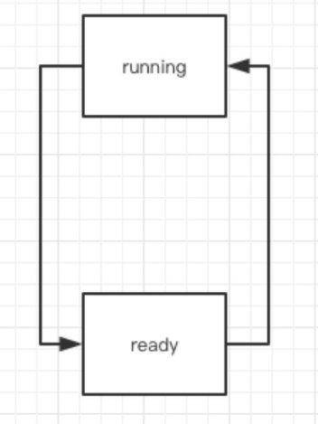
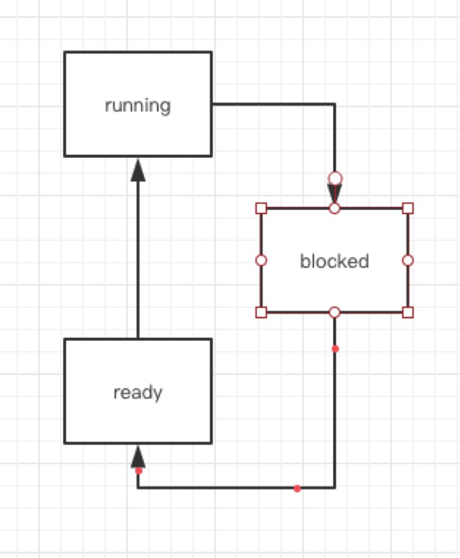
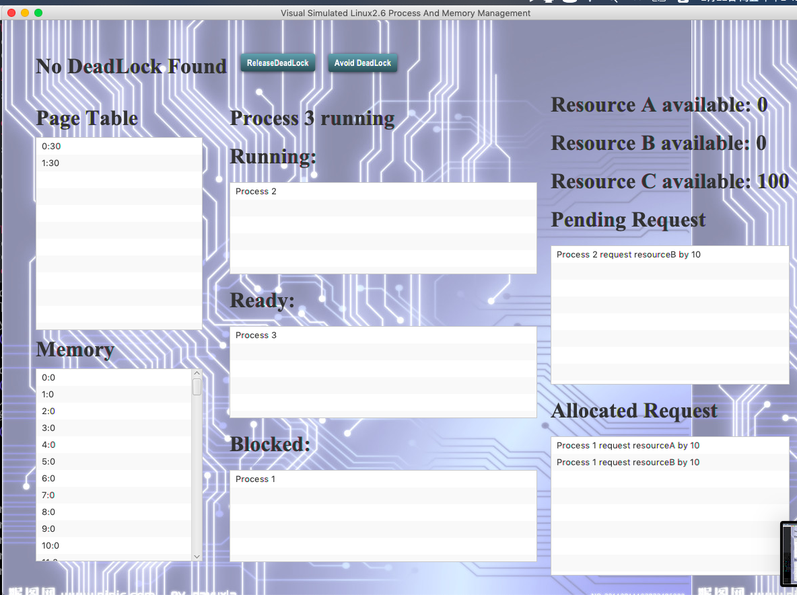

# 操作系统课程设计报告
# GUI库 JavaFX
## 为什么选择JavaFX
因为Swing的过于老旧,我们认为选择更加新颖的库比较合适.
同时JavaFX又十分成熟,不会存在使用上的bug.适合生产用途.

## JavaFX介绍
JavaFX是一个庞大的库,支持XML文件编写UI布局,动画特效,内嵌Web等多种功能,它的架构如图1所示.


<center>图1</center>
但本次课设,仅使用其中的部分内容.详情请参考JavaFX文档.
1. 场景图 
2. UI控件 
3. 布局
4. CSS

## javaFX的多线程
在系统运行时会有下面的两个或更多线程：

● JavaFX应用程序线程：这是JavaFX应用开发者使用的主要线程。任何“活动”的场景都是窗体的一部分，它们都必需通过此线程来访问。场景图可以通过一个后台线程来创建和控制，但是如果其根节点与任何活动对象相关，则该场景图必需通过JavaFX应用程序线程来访问。这允许开发者在背景线程上创建复杂的场景图，而与此同时在“活动”场景中保持动画的流畅。由于JavaFX应用程序线程与Swing和AWT事件调度线程(EDT)不同，所以在将JavaFX代码嵌入到Swing应用程序中时必需小心。

● Prism渲染线程：此线程处理渲染工作，使其与事件调度器独立开来。它使得第N帧在被渲染时可以对第N+1帧进行处理。这种并行处理机制具有很大的优势，尤其是在具有多处理器的现代操作系统上。Prism渲染线程可以带有多个光栅化线程来协助处理渲染相关的工作。

● 多媒体线程:此线程会在后台运行，通过使用JavaFX应用程序线程来在场景图中同步最近的帧

本次课设需要使用多线程,来处理进程和内存管理,并且进程的运行和内存的存取,都是并发的.

# 整体设计
## 并发的模拟
- 使用特殊的并发类 `javafx.concurrent.Task`
Task与Runnable类似，Runnable 可用于初始化线程。它是为javatx GU特别设计的，a因为在javafx中， UI元素的所有更新都必须应用于主javatx线程上，这是为了线程安全。但是在某些情况下，比如本课程设计，我们必须在另一个线程中更新UI元素。例如，在本课程设计中。一个过程的每一条指令都应该被用户清楚地观察到。为了实现这一点，我们在执行下一条指令之前让进程休眠一段时间，如果进程在主javafx线程上运行，GUI也将停止，直到在任何preocess上不再休眠。所以我们必须使进程运行在其他线程任务上，才能使线程安全成为可能。

- 延迟运行 `Platform.RunLater`
在某些情况下，直接从另一个线程更改fx线程上的变量是必要的。Platform.RunLater在两个线程之间设置同步，为了确保线程安全，可以将代码输入到Platform.RunLater.中去.

- 属性绑定 `bind`
任务利用java bean的属性类和绑定方法。属性是变量的封装，两个属性如果其中一个值改变了，另一个也会随之改变。Task有内置属性可用于绑定，UI元素也有等待绑定的内置属性。我们可以绑定它们，从而更改任务线程上的属性，而且也可以更改UI元素的属性，该属性在javafx线程上是安全的。

## 硬件的模拟
### 时钟中断(CLOCK)
在硬件中,时钟定时发出脉冲,实现中断信号的产生,
在模拟中,我们反其道而行,大部分时间,线程处于睡眠态,每隔一定时间,从睡眠中醒来,执行任务.
两者的表现是类似的.
我们用 `Thread.sleep()`来实现线程的休眠.

### 总线(BUS)
我们将总线的存在实体化,设计出Bus类,所有数据传输,都被送入该类,
接收数据的类会监听Bus,取出数据.

### 内存管理单元(MMU)
在硬件中,指令在执行阶段, 发出逻辑地址,传至MMU.由MMU查询页表,完成地址转换,之后从内存取数据,存数据,最后完成指令.
牵涉到指令, 逻辑地址,MMU,页表, 内存,数据总线.
而MMU承前启后, 连接了指令和内存,因此MMU和指令,内存紧密联系.

## 进程的调度

### 高级调度
采用异步加载,在程序运行中,进程逐步加入内存,时间可以事先确定,也可以随机确定.

``
	void loadNewProcess() {
		if(!loadTimes.isEmpty() && time == loadTimes.get(0)) {
			// add all pros at init time, but load it one by one
			int pid = pros.get(0).pid;
			ready.addAll(pros.remove(0));
			loadTimes.remove(0);
			updateMessage("new process: process "+pid+" loaded");
		}
		time++;
	}
``


### 中级调度
当程序请求资源的时候,会被阻塞,等到资源分配完毕,才能转入就绪态.
进程请求资源后, 设置变量`	blocked = true;`
在下次被调度时,放入`blocked`

``
else if(cur.blocked) {
			blocked.addAll(running.remove(0));
			if(!ready.isEmpty()) {
				running.addAll(ready.remove(0));
			}
		}
``


### 低级调度
在running和ready两种状态间切换,切换方法为时间片轮转法.
具体实现方法是
`class Process  implements Comparable<Process>`
把Process放入队列,按照`vruntime`排序,选择
Process运行`run()`就会消耗自己的时间片,消耗完后主动放弃CPU使用,被调度器调度.

### 三态转换
我们必须处理两种情况。首先,运行和准备开关。在不考虑资源请求的情况下，采用循环调度算法。我们按程序的准备队列进行分类。vruntime来决定哪个是正在运行的候选者。

第二个与资源请求有关联。当进程调用request（）时，必须阻止，直到资源得到正确的分配。然后它可以放在等待、准备队列中或者被选中去运行。


以下为具体的实现

```
void stageSwitch(Process cur) {
		if(cur.done) {
			running.remove(0);
			if(!ready.isEmpty()) {
				running.addAll(ready.remove(0));
			}
		}
		else if(cur.blocked) {
			blocked.addAll(running.remove(0));
			if(!ready.isEmpty()) {
				running.addAll(ready.remove(0));
			}
		}
		else {
			if(!ready.isEmpty()) {
				ready.addAll(running.remove(0));
				running.addAll(ready.remove(0));
			} 
		}
						
	}
```


## 死锁的管理

### 避免
我们采用了银行家算法的变种,
没有完全实现银行家算法,因为不是所有死锁都可以避免,
而是在银行家算法安全序列的思想指导下,
排列组合,寻找出最不容易死锁的请求顺序,
注意,要使用银行家算法必须在请求发生前使用,不然木已成舟,于事无补了.

### 检测

我们使用以下条件检查是否存在死锁。如果有两个资源，res1和res2。且两个进程的pids ：pida和pidb满足以下条件：

1. pida in res1.pending 
2. pidb in res1.allocated
3. pida in res2.allocated 
4. pidb in res2.pending 
5. pida 和 pidb不能同时满足 

因此我们发现了死锁。（下面是部分源代码的实现）


``
void checkDeadLock() {
		if(lk != null) return;
		if(denyCheckDeadLock == true) return;
		for(Request r1 : requestPending) {
			Resource res1 = res[r1.tp];
			for(Resource res2 : res) {
				ArrayList<Integer> pida = (ArrayList<Integer>)res1.pending.clone();
				ArrayList<Integer> pidb = (ArrayList<Integer>)res2.pending.clone();
				pida.retainAll(res2.allocated); 
				pidb.retainAll(res1.allocated);
				if(pida.isEmpty() || pidb.isEmpty()) continue;
				int a, b;
				a = pida.get(0);
				b = pidb.get(0);
				tfDeadLock.setText("DeadLock Found:"+"Process "+a+" "+"Process "+b+" for "+"res"+res1.type+" and res"+res2.type);
				lk = new DeadLock(a, b, res1.tp, res2.tp);
			}
		}
	}
``


### 释放
死锁数据结构中保存了争夺资源的两个进程pid,选择请求资源多的一个,杀死该进程,从而解除死锁.


## 内存的分配


# 数据结构和类的划分

## 前端
- Main
由Scene1 数据结构表示, 如下图所示.
采用了BorderPane布局设计, 分为top, left, right, center,四个部分.
其数据显示与后台数据相互绑定,实时显示.
如图


### 调试模式
为了方便调试,在代码中添加了调试模式,和实时模式两种,
在调试模式时,用户可以随意控制进程的运行,
在实时模式时,用户无法插手系统的运行.

## 后端
Java是纯面向对象的,我们有许多的辅助类,但在这里,只列出了最重要的类.
- Process

- Scheduler

- PageTable

- Memory


它们之间的关系如下图所示


# 分工
本组组长为陈锋,组员为吴永琨
在寒假期间,我们多次通过QQ,以文字,图片,音频,视频等形式交流讨论意见.
包括对题目的理解与代码的工程实现.

一开始我们的分工为一人做前端,一人做后端,在课设过半时,我们产生了激烈的意见冲突,
冷静下来后,我们发现之前的分工存在不合理之处,做后端的人必须完全理解前端的知识,
做前端的人必须明白后端的意图
于是我们改变了分工,重新开始.

由陈锋设计整体结构,并完成进程管理与死锁管理的前端和后端,
由吴永琨完成内存分配与回收的前端和后端,并美化界面.

在课设中,我们互相学习了对方的编程技巧,从不善于沟通,到能够以各种形式表达自己的观点,表现程序设计思路,获得了很大的收获.并合作编写了本次课设报告.

# 参考文献
[JavaFX中文文档](http://www.javafxchina.net/blog/docs/)

[Operating Systems: Internals and Design Principles, Sixth Edition](https://book.douban.com/subject/5064311/)


